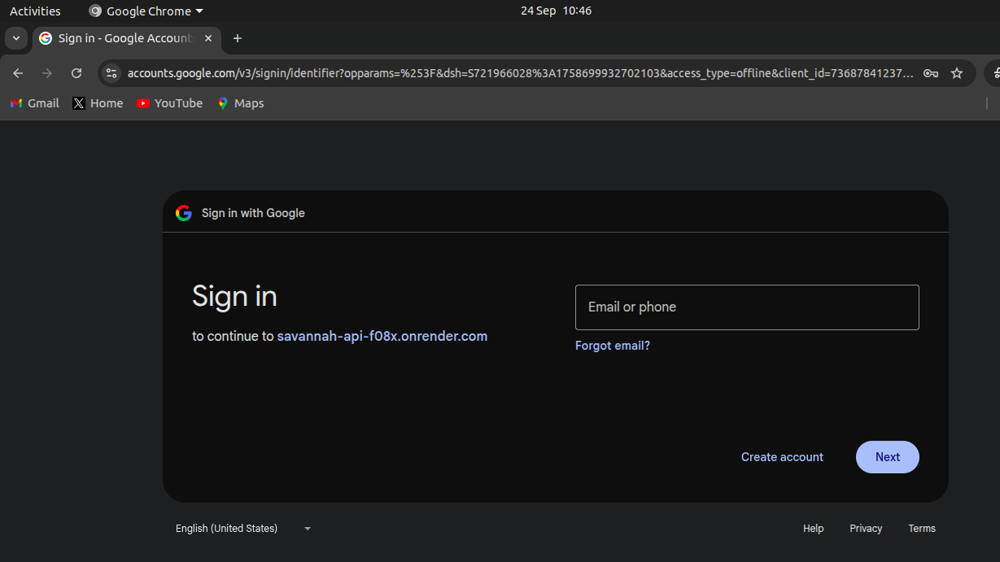
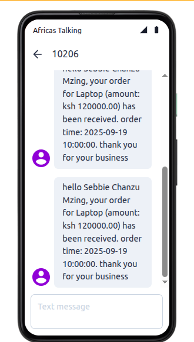

## Savannah Informatics REST API Assessment

### A comprehensive REST API built with Go for managing customers and orders, featuring OpenID Connect authentication and SMS notifications via Africa's Talking.

### Things to take note of:
### BASE_URL:

```json 
http://localhost:8080 
```

### PROD_URL:

```json
https://savannah-api-f08x.onrender.com 
```

### Architecture.
- **`./`** → Application entrypoints  
- **`internal/handlers/`** → HTTP request handlers and auth logic + customer and order tests
- **`internal/middleware/`** → HTTP middleware and auth logic + auth tests
- **`internal/models/`** → Data models
- **`internal/services/`** → sms logic services + sms tests
- **`.github/workflows/`** → CI/CD pipelines  
- **`docs/`** → API documentation  

## Tech Stack

- **Language**: Go (Golang) - 1.24.2
- **Framework**: Gin
- **Database**: [PostgreSQL (Neon.tech)](https://neon.tech) + GORM
- **Auth**: OpenID Connect, JWT
- **Messaging**: Africa's Talking SMS API
- **Deployment**: Docker, GitHub Actions


## Quick Start

### 1. Clone and Setup
```bash
# clone the repo.
git clone https://github.com/your_username/savannah-api.git
cd savannah-api

# copy env vars.
cp .env.example .env (replacing with your own values)

# download dependencies.
go mod download
go mod tidy
```

### 2. Configure Environment

Edit the `.env` file with your configuration:

```env
# Database
DATABASE_URL=postgresql://<DB_USER>:<DB_PASSWORD>@<DB_HOST>/<DB_NAME>?sslmode=require&channel_binding=require

# Server
PORT=8080
GIN_MODE=release

# SMS (Africa's Talking)
AFRICASTALKING_USERNAME=sandbox
AFRICASTALKING_API_KEY=your_api_key_here
AFRICASTALKING_SENDER_ID=your_sender_id #you can use the short code

# JWT
JWT_SECRET=your-super-secret-jwt-key-here

# OpenID Connect (OIDC)
OIDC_PROVIDER_URL=https://your-oidc-provider.com
OIDC_CLIENT_ID=your_client_id
OIDC_CLIENT_SECRET=your_client_secret
OIDC_REDIRECT_URI=http://localhost:8080/auth/callback #localhost

# App Settings
APP_ENV=production or development
API_VERSION=v1
```

### 3. start the development environment
```bash
go run main.go
```

```bash
curl http://localhost:8080/health 
# expected response: {"status":"ok"}
```

#### running tests (with coverage)
```bash
go test -v -cover ./...
```

## API Documetation
All API endpoints (except /health and /auth/login) require authentication.

# 1. Auth
## Login Endpoint (OIDC)

This endpoint handles **user authentication** via **OpenID Connect (OIDC)**.  
Instead of sending credentials directly, the user is redirected to the **identity provider** (e.g., Google) to sign in.  


- **Endpoint:**  
  `GET {{PROD_URL}}/auth/login`

---

### Flow

1. Client calls `GET /auth/login`.
2. API responds with a **redirect** to the OIDC provider (e.g., Google Sign-In).
3. User chooses an account and grants consent.
4. On successful authentication, the OIDC provider redirects back to your API (`/auth/callback`).
5. API exchanges the authorization code for tokens and issues a **JWT access token**.

---

### Successful Response

When login completes successfully, the API responds with a JSON payload containing the access token:

```json
{
  "auth": {
    "access_token": "eyJhbGciOiJIUzI1NiIsInR5cCI6IkpXVCJ9....",
    "refresh_token": "",
    "expires_in": 86400,
    "token_type": "Bearer"
  },
  "state": "state-20250924050920"
}
```

## User Info Endpoint

Retrieve details of the authenticated user.

- **Method:** `GET`  
- **URL:** `{{PROD_URL}}/auth/userinfo`  
- **Auth:** Requires `Authorization: Bearer <access_token>`

### Sample Response
```json
{
  "sub": "100257460275121464496",
  "email": "sebbievilar2@gmail.com",
  "name": "Sebbie Chanzu",
  "iss": "customer-order-api",
  "aud": "customer-order-api",
  "exp": 1758776967,
  "iat": 1758690567
}
```
---

# 2. Customers

## Add Customer

Create a new customer.  

- **Method:** `POST`  
- **URL:** `{{PROD_URL}}/api/v1/customers`  
- **Auth:** Requires `Authorization: Bearer <access_token>`

### Request Body
```json
{
  "name": "Sebbie Meth",
  "code": "CUST127",
  "phone": "0712355645",
  "email": "sebbievila4@gmail.com"
}
```

### sample responses
#### successful response
```json 
{
  "id": 6,
  "name": "Sebbie Evayo",
  "code": "CUST125",
  "phone": "0712345645",
  "email": "sebbievilar3@gmail.com",
  "created_at": "2025-09-21T21:23:36.647233369+03:00",
  "updated_at": "2025-09-21T21:23:36.647233369+03:00"
}
```

#### conflict(409)
```json
{
  "error": "customer_exists",
  "message": "customer with this code already exists",
  "code": 409
}
```

## Get Customers

Retrieve a paginated list of customers.

- **Method:** `GET`  
- **URL:** `{{PROD_URL}}/api/v1/customers`  
- **Auth:** Requires `Authorization: Bearer <access_token>`

### Example Response
```json
{
  "customers": [
    {
      "id": 1,
      "name": "John Doe",
      "code": "CUST123",
      "phone": "0712345678",
      "email": "john@example.com",
      "created_at": "2025-09-19T10:03:22.470304+03:00",
      "updated_at": "2025-09-19T10:03:22.470304+03:00"
    },
    {
      "id": 2,
      "name": "Sebbie Chanzu",
      "code": "CUST121",
      "phone": "0712345645",
      "email": "sebbievilar2@gmail.com",
      "created_at": "2025-09-19T10:04:58.663213+03:00",
      "updated_at": "2025-09-19T10:04:58.663213+03:00"
    }
  ],
  "limit": 10,
  "page": 1,
  "total": 2
}
```

## Get a single Customer

Retrieve details of a single customer and their orders.

- **Method:** `GET`  
- **URL:** `{{PROD_URL}}/api/v1/customer/{customer_id}`  
- **Auth:** Requires `Authorization: Bearer <access_token>`

### sample responses
#### success
```json
{
  "id": 2,
  "name": "Sebbie Chanzu",
  "code": "CUST121",
  "phone": "0740827150",
  "email": "sebbievilar2@gmail.com",
  "created_at": "2025-09-19T10:04:58.663213+03:00",
  "updated_at": "2025-09-19T10:57:19.162353+03:00",
  "orders": [
    {
      "id": 2,
      "item": "Laptop",
      "amount": 120000,
      "time": "2025-09-19T13:00:00+03:00",
      "customer_id": 2,
      "created_at": "2025-09-19T11:14:13.946158+03:00",
      "updated_at": "2025-09-19T11:14:13.946158+03:00"
    }
  ]
}
```

#### not found
```json
{
  "error": "customer not found",
  "message": "customer not found",
  "code": 404
}
```

## Update Customer

Update details of an existing customer.  

- **Method:** `PUT`  
- **URL:** `{{PROD_URL}}/api/v1/customers/{customer_id}`  
- **Auth:** Requires `Authorization: Bearer <access_token>`

### Request Body
```json
{
  "name": "Sebbie Chanzu Meth",
  "phone": "0740847150"
}
```

### success
``` json
{
  "id": 2,
  "name": "Sebbie Chanzu Mzing",
  "code": "CUST121",
  "phone": "0740827150",
  "email": "sebbievilar2@gmail.com",
  "created_at": "2025-09-19T10:04:58.663213+03:00",
  "updated_at": "2025-09-21T21:02:40.59370307+03:00"
}
```

#### not found
```json
{
  "error": "customer not found",
  "message": "customer not found",
  "code": 404
}
```

## delete customer

Delete a customer by ID.

- **Method:** `DELETE`  
- **URL:** `{{PROD_URL}}/api/v1/customers/{customer_id}`  
- **Auth:** Requires `Authorization: Bearer <access_token>`

### sample responses
#### success
```json
{
  "message": "customer deleted successfully"
}
```

#### not found
```json
{
  "error": "customer not found",
  "message": "customer not found",
  "code": 404
}
```

# 3. Orders

## Create Order

Create a new order.  

- **Method:** `POST`  
- **URL:** `{{PROD_URL}}/api/v1/orders`  
- **Auth:** Requires `Authorization: Bearer <access_token>`

### Request Body
```json
{
  "item": "Phone",
  "amount": 12000,
  "time": "2025-09-19T10:00:00Z",
  "customer_id": 10
}
```

### sample responses
#### success
```json
{
  "id": 1,
  "item": "Laptop",
  "amount": 120000,
  "time": "2025-09-19T13:00:00+03:00",
  "customer_id": 2,
  "customer": {
    "id": 2,
    "name": "Sebbie Chanzu",
    "code": "CUST121",
    "phone": "0740827150",
    "email": "sebbievilar2@gmail.com",
    "created_at": "2025-09-19T10:04:58.663213+03:00",
    "updated_at": "2025-09-19T10:57:19.162353+03:00"
  },
  "created_at": "2025-09-19T11:00:55.003199+03:00",
  "updated_at": "2025-09-19T11:00:55.003199+03:00"
}
```

### message sent to the phone(sandbox) upon successful order creation


#### customer not found
```json
{
  "error": "customer not found",
  "message": "customer not found",
  "code": 404
}
```

## List Orders

Retrieve all orders with pagination support.  

- **Method:** `GET`  
- **URL:** `{{PROD_URL}}/api/v1/orders`  
- **Auth:** Requires `Authorization: Bearer <access_token>`

### Example Response

**Success (200 OK)**  
```json
{
  "limit": 10,
  "page": 1,
  "total": 6,
  "orders": [
    {
      "id": 2,
      "item": "Laptop",
      "amount": 120000,
      "time": "2025-09-19T13:00:00+03:00",
      "customer_id": 2,
      "customer": {
        "id": 2,
        "name": "Sebbie Chanzu Mzing",
        "code": "CUST121",
        "phone": "0740827150",
        "email": "sebbievilar2@gmail.com",
        "created_at": "2025-09-19T10:04:58.663213+03:00",
        "updated_at": "2025-09-21T21:02:40.593703+03:00"
      },
      "created_at": "2025-09-19T11:14:13.946158+03:00",
      "updated_at": "2025-09-19T11:14:13.946158+03:00"
    }
  ]
}
```

## Get Order by ID

Retrieve details of a specific order.  

- **Method:** `GET`  
- **URL:** `{{PROD_URL}}/api/v1/orders/{order_id}`  
- **Auth:** Requires `Authorization: Bearer <access_token>`

### Example Responses

**Success (200 OK)**  
```json
{
  "id": 6,
  "item": "Laptop",
  "amount": 120000,
  "time": "2025-09-19T13:00:00+03:00",
  "customer_id": 2,
  "customer": {
    "id": 2,
    "name": "Sebbie Chanzu Mzing",
    "code": "CUST121",
    "phone": "0740827150",
    "email": "sebbievilar2@gmail.com",
    "created_at": "2025-09-19T10:04:58.663213+03:00",
    "updated_at": "2025-09-21T21:02:40.593703+03:00"
  },
  "created_at": "2025-09-19T11:51:33.423369+03:00",
  "updated_at": "2025-09-19T11:51:33.423369+03:00"
}
```

**order not found**
```json
{
  "error": "order not found",
  "message": "order not found",
  "code": 404
}
```

## Update Order  

Update an existing order by ID.  

- **Method:** `PUT`  
- **URL:** `{{PROD_URL}}/api/v1/orders/{id}`  
- **Auth:** Requires `Authorization: Bearer <access_token>`  

### Example Request  
```json
{
  "item": "Gaming Laptop",
  "amount": 150000
}
```

### sample responses
**success**
```json
{
  "id": 3,
  "item": "Gaming Laptop",
  "amount": 150000,
  "time": "2025-09-19T13:00:00+03:00",
  "customer_id": 2,
  "customer": {
    "id": 2,
    "name": "Sebbie Chanzu Mzing",
    "code": "CUST121",
    "phone": "0740827150",
    "email": "sebbievilar2@gmail.com"
  },
  "created_at": "2025-09-19T11:36:11.401138+03:00",
  "updated_at": "2025-09-21T22:19:19.508104+03:00"
}
```

**not found**
```json
{
  "error": "order not found",
  "message": "order not found",
  "code": 404
}
```

## Delete Order  

Remove an order by ID.

- **Method:** `DELETE`  
- **URL:** `{{PROD_URL}}/api/v1/orders/{id}`  
- **Auth:** Requires `Authorization: Bearer <access_token>`  

**sucess**
```json
{
  "message": "order deleted successfully"
}
```

**not found**
```json
{
  "error": "order not found",
  "message": "order not found",
  "code": 404
}
```